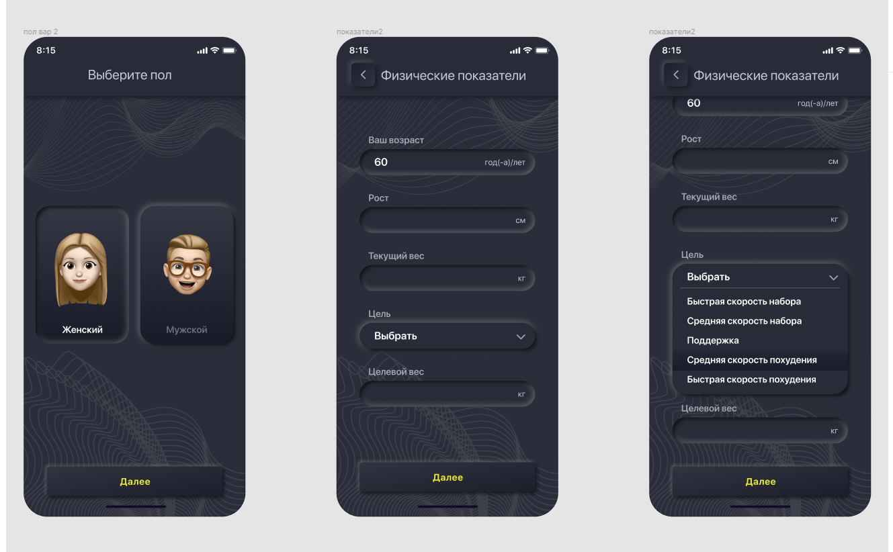

# mobile-app

#### Сверстать и создать мини приложение на Vue js фреймфорке.
https://www.figma.com/file/BMgv2hIZ3nGZfJoDOnQLmP/Untitled



#### Функционал:
```
При нажатии "далее" должен перелистнуться слайд и открыться поля ввода.   
Вторая кнопка "далее" выводит все заполенные поля обоих страниц.

Реализовать плавную анимацию нажатия на кнопках и выпадающий список.

Интерфейс телефона делать не надо. Достаточно создать контейнер с органиченной шириной и высотой.
Для работы использовать сборшик webpack или любой другой.
```

#### Демо:
https://slay9090.github.io/mobile-app
